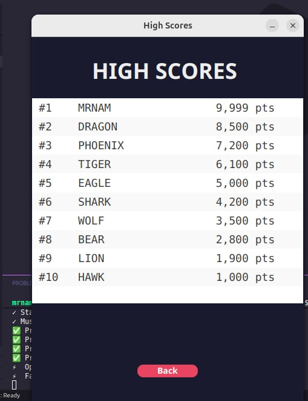

# OOP-Arkanoid
## A-PIE Overflow

---
Group 2 - Class INT_2204_11  
1. Nguyễn Dương Minh  
2. Phạm Hoài Nam  
3. Hoàng Trọng Nhật Linh  
4. Trần Nguyễn Hoàng    
**Instructor:** Kiều Văn Tuyên
**Semester:** HK1 - 2025-2026
## Description

---
This is a classic Arkanoid game developed in Java as a final project for Object-Oriented Programming course. The project demonstrates the implementation of OOP principles and design patterns.  
**Key feature**  
1. Tựa game được phát triển bằng Java 17+ với JavaFX/Swing for GUI.
2. Thực hiện các nguyên tắc OOP cốt lõi: Đóng gói, Kế thừa, Đa hình và Trừu tượng.
3. Sử dụng các design patterns: Singleton,  
4. Tính năng đa luồng để game vẫn hoạt động mượt mà và UI đáp ứng người dùng
5. Bao gồm sound effects, animations, and power-up systems.
6. Hỗ trợ lưu high score

**Game mechanics** 
1. Sử dụng paddle để đẩy bóng phá gạch.
2. Thu thập các power-up để có các hiệu ứng đặc biệt.  
3. Nhiều level với độ khó và giao diện khác nhau.  
4. Lưu score màn chơi và high score.  

## UML Diagram

---
Class Diagram  

## Design Patterns Implementation

---
1. **Singleton Pattern**  
    Used in: SoundManager, SceneCache.  
2. **Template Method Pattern**  
    Used in: PowerUp
3. **Stratery Pattern**  
    Used in: CheckCollision
4. **Facade Pattern**  
    Used in: SceneNavigator.
5. **Factory Method**  
    Used in: SpriteLoader.
6. **Observer Pattern** 
    Used in: EventHandleController.
## Multithreading Implementation  

---
**1. Rendering Thread:** Handles graphics rendering (EDT for JavaFX Application Thread)   
**2. Audio Thread Pool:** Plays sound effects asynchronously.  
**3.Game Loop Thread:** Updates game logic at 30 FPS

## Installation

---  
1. Clone the project from the repository.  
2. Open the project in the IDE.  
3. Run the project.  

## Usage  

---
**Controls**

|  Key  |       Action       |
|:-----:|:------------------:|
|   A   |  Move paddle left  |
|   D   | Move paddle right  |
| SPACE |    Launch ball     |

**How to Play**  
1. **Start the game**: Click "Start" from the Main Menu.  
2. **Control the paddle**: Use A/D to move left and right.  
3. **Launch the ball**: Press SPACE to launch the ball from the paddle.
4. **Destroy bricks**: Bounce the ball to hit and destroy bricks.  
5. **Collect power-ups**: Catch falling power-ups for special abilities.  
6. **Avoid losing the ball**: Keep the ball from falling below the paddle.  
7. **Complete the level**: Destroy all destructible bricks to advance.  

**Power-ups**

| Name          | Effect                | Icon |
|---------------|-----------------------|------|
| FastBall      | Boost ball speed      |  |
| FastPaddle    | Boost paddle speed    |  |
| MultiBall     | Spawns 2 additional balls |  |
| SlowBall      | Decrease ball speed   |  |
| SlowPaddle    | Decrease paddle speed |  |
| RandomPowerUp | Random effect         |  |
| ExtraLife     | Gain  extra life      | |
| PointBonus    | Gain extra points     |  |
                                                                 |

**Scoring System**  

## Demo 

---

### Screenshots

**Main Menu** 

**Gameplay**  

**Power-ups in Action**   

**Highscore** 

**VideoDemo**  

## Future Improvements

---
### Planned Features
1. Additional game modes  
   - Time attacks mode.  
   - Co-op multiplayer mode.  
2. Enhanced gameplay
   - Boss battle at end of final levels.  
   - More power-up varieties(shield,etc.)  
   - Achievements system.  
3. Technical improvements
    - AI opponnt mode.  
    - Multiplayer mode.  
    - Online mode  

## Technologies Used

---

| Technology | Version | Purpose |
|:-----------:|:-------:|:--------|
| **Java**     |   17+   | Core language |
| **JavaFX**   | 19.0.2  | GUI framework |
| **Maven**    |  3.8.7  | Build tool |

## License  

---
This project is developed for educational purposes only.

**Academic Integrity**: This code is provided as a reference. Please follow your institution's academic integrity policies.  

## Notes 

---
1. The game was developed as part of the Object-Oriented Programming with Java course curriculum.
2. All code is written by group members.  
3. The project demonstrates practical application of OOP concepts and design patterns.

---
_Last updated: 12/11/2025_

